# Documentación de Casos de Uso - proagrocompras

Este documento lista los Casos de Uso para los artefactos (módulos) presentes en el proyecto. Para cada caso se incluye: resumen, actores, precondiciones, postcondiciones, flujo principal, flujos alternativos y reglas de negocio.

---

## Diagrama Entidad-Relación (PlantUML) - ER

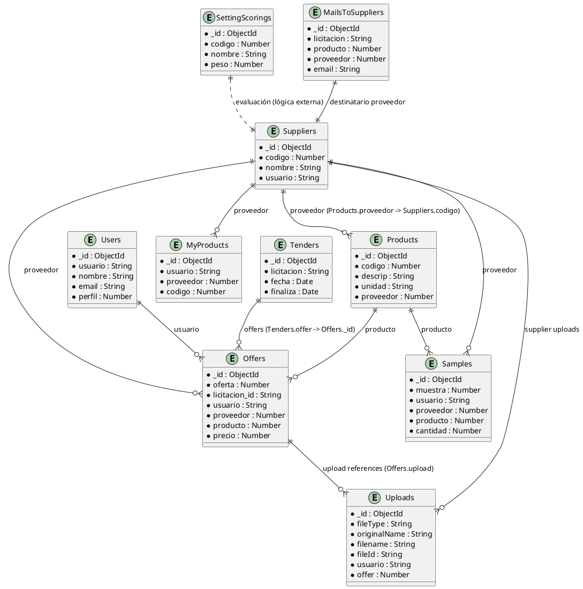

Guía rápida:

- Pega el bloque PlantUML en un archivo `docs/ER_Diagrama.puml` y usa la extensión PlantUML en VSCode para renderizar.
- También puedes usar `https://www.plantuml.com/plantuml` para obtener una imagen rápidamente.

---

## Diagrama ER por Módulo (archivos)

A continuación están los diagramas ER desglosados por módulo. Cada archivo está en `docs/` y es un PlantUML independiente para facilitar su visualización y mantenimiento.

- `docs/ER_users.puml` - Usuarios y sus referencias
- `docs/ER_suppliers.puml` - Proveedores y relaciones con productos y subidas
- `docs/ER_products.puml` - Productos y relaciones con ofertas/muestras
- `docs/ER_myproducts.puml` - Mis productos (por proveedor/usuario)
- `docs/ER_offers.puml` - Ofertas y referencias a usuarios, proveedores y uploads
- `docs/ER_tenders.puml` - Licitaciones y lista de ofertas
- `docs/ER_uploads.puml` - Archivos subidos y enlaces a ofertas/usuarios
- `docs/ER_samples.puml` - Solicitudes de muestras y resultados
- `docs/ER_settingScorings.puml` - Criterios de scoring
- `docs/ER_mailsToSuppliers.puml` - Envíos de correo masivo a proveedores

Puedes abrir cualquiera de estos archivos en VSCode con la extensión PlantUML o renderizarlos online.

### Diagramas (imágenes)

Se han generado imágenes PNG de cada diagrama. Si no se visualizan en el preview de VSCode, asegúrate de abrir el archivo `docs/CasosDeUso.md` desde el mismo workspace y que la extensión de Markdown puede cargar imágenes locales.

## Plantilla de Caso de Uso (aplicar a todos los artefactos)
- Identificador: CU-<MÓDULO>-<N>
- Nombre: <Nombre del caso de uso>
- Objetivo: <Breve objetivo>
- Actores: <Actores que intervienen>
- Precondiciones: <Estado requerido antes de ejecutar>
- Postcondiciones: <Estado posterior>
- Flujo principal: Paso a paso del flujo principal
- Flujos alternativos / Excepciones: Casos alternativos y errores
- Reglas de negocio: Reglas aplicables
- Datos involucrados / Endpoints: Campos clave, rutas API y permisos

---

## 1. Autenticación y Autorización (auth.config.js, server.js, routes.js)
### CU-AUTH-1: Login / Autenticación
- Actores: Usuario
- Objetivo: Obtener token JWT para acceder a recursos protegidos
- Precondiciones: Usuario registrado con credenciales válidas
- Postcondiciones: Token de acceso devuelto
- Flujo principal: 1) Usuario envía credenciales -> 2) Sistema valida -> 3) Devuelve token
- Alternativos: Credenciales inválidas -> rechaza con 401
- Endpoints: POST /login, POST /refresh-token

### CU-AUTH-2: Logout / Revocación de sesión
- Actores: Usuario
- Objetivo: Invalidar token de sesión (si aplica)
- Precondiciones: Token vigente
- Postcondiciones: Sesión invalidada
- Flujo principal: 1) Usuario solicita logout -> 2) Sistema elimina/ marca token inválido

---

## 2. Usuarios (`users/`, `user.controller.js`, `user.dao.js`, `users.model.js`)
### CU-USR-1: Registrar usuario
- Actores: Usuario (autoregistro) / Admin
- Objetivo: Crear una cuenta de usuario
- Precondiciones: Datos requeridos provistos (email, password...)
- Postcondiciones: Usuario creado en BD
- Endpoints: POST /users

### CU-USR-2: Iniciar sesión (delegado a Auth)
- Ver CU-AUTH-1

### CU-USR-3: Obtener perfil
- Actores: Usuario autenticado, Admin
- Objetivo: Recuperar datos del usuario
- Precondiciones: Token válido
- Postcondiciones: Datos devueltos
- Endpoints: GET /users/:id

### CU-USR-4: Actualizar usuario
- Actores: Usuario autenticado, Admin
- Objetivo: Actualizar datos del usuario
- Precondiciones: Permisos correctos
- Endpoints: PUT /users/:id

### CU-USR-5: Eliminar usuario
- Actores: Admin
- Objetivo: Eliminar o desactivar cuenta
- Endpoints: DELETE /users/:id

Reglas de negocio: Validación de email único, requisitos de contraseña, roles y permisos.

---

## 3. Productos (`products/`)
Casos típicos CRUD:
- CU-PROD-1: Crear producto (POST /products)
- CU-PROD-2: Listar productos (GET /products)
- CU-PROD-3: Obtener producto (GET /products/:id)
- CU-PROD-4: Actualizar producto (PUT /products/:id)
- CU-PROD-5: Eliminar producto (DELETE /products/:id)

Actores: Admin, Proveedor, Comprador
Reglas: Validaciones de SKU, stock, precios, permisos por rol.
Datos: nombre, descripcion, precio, unidad, categoria, proveedorId

---

## 4. Mis Productos (`myproducts/`)
- CU-MYPROD-1: Registrar producto propio (POST /myproducts)
- CU-MYPROD-2: Listar mis productos (GET /myproducts?ownerId=)
- CU-MYPROD-3: Actualizar producto propio (PUT /myproducts/:id)
- CU-MYPROD-4: Eliminar producto propio (DELETE /myproducts/:id)

Actores: Proveedor autenticado
Reglas: Un proveedor solo puede gestionar sus propios productos.

---

## 5. Proveedores (`suppliers/`)
- CU-SUP-1: Registrar proveedor (POST /suppliers)
- CU-SUP-2: Listar proveedores (GET /suppliers)
- CU-SUP-3: Actualizar proveedor (PUT /suppliers/:id)
- CU-SUP-4: Eliminar proveedor (DELETE /suppliers/:id)
- CU-SUP-5: Evaluar proveedor (interno, relacion con settingScorings)

Actores: Admin, Sistema
Reglas: Verificaciones de documento, validación de contacto.

---

## 6. Ofertas (`offers/`)
- CU-OFF-1: Crear oferta para una cotización/licitación (POST /offers)
- CU-OFF-2: Listar ofertas por cotización/usuario (GET /offers?cotizacionId=)
- CU-OFF-3: Aceptar/Rechazar oferta (POST /offers/:id/accept)
- CU-OFF-4: Actualizar oferta (PUT /offers/:id)

Actores: Proveedor, Comprador
Reglas: Plazos de presentación, unicidad por proveedor/cotización.

---

## 7. Cotizaciones (`cotizaciones/`)
- CU-COT-1: Crear cotización (POST /cotizaciones)
- CU-COT-2: Publicar cotización / Solicitar ofertas (POST /cotizaciones/:id/publish)
- CU-COT-3: Listar cotizaciones (GET /cotizaciones)
- CU-COT-4: Consultar cotización (GET /cotizaciones/:id)
- CU-COT-5: Cerrar cotización / Seleccionar ganador

Actores: Comprador, Proveedor
Reglas: Plazo de recepción, criterios de evaluación, notificaciones.

---

## 8. Licitaciones / Tenders (`tenders/`)
- CU-TEND-1: Crear licitación (POST /tenders)
- CU-TEND-2: Publicar licitación (POST /tenders/:id/publish)
- CU-TEND-3: Enviar propuesta a licitación (POST /tenders/:id/proposals)
- CU-TEND-4: Cerrar licitación y adjudicar (POST /tenders/:id/close)

Actores: Comprador, Proveedor
Reglas: Requisitos de presentación, documentos obligatorios.

---

## 9. Muestras (`samples/`)
- CU-SMP-1: Solicitar muestra (POST /samples)
- CU-SMP-2: Enviar actualización de estado de muestra (PUT /samples/:id)
- CU-SMP-3: Listar solicitudes de muestra (GET /samples)

Actores: Comprador, Proveedor
Datos: Direccion de envío, cantidad, estado (solicitado, enviado, recibido)

---

## 10. Correos y Comunicaciones (`emails/`, `mailsToSuppliers/`)
### CU-EMAIL-1: Generar correo del sistema
- Actores: Sistema, Admin
- Objetivo: Componer plantillas de correo (notificaciones)
- Endpoints: POST /emails/preview

### CU-MAILS-TS-1: Enviar correo a proveedores (mailsToSuppliers)
- Actores: Admin, Sistema
- Objetivo: Enviar mails masivos o individuales a proveedores
- Precondiciones: Lista de proveedores y plantilla
- Postcondiciones: Correos enviados / colas de envío
- Endpoints: POST /mails-to-suppliers/send

Reglas: Manejo de reintentos, control de tasas, logs de envío.

---

## 11. Ayuda / Tickets (`help/`)
- CU-HELP-1: Crear ticket de ayuda (POST /help)
- CU-HELP-2: Asignar ticket (PUT /help/:id/assign)
- CU-HELP-3: Responder y cerrar ticket (PUT /help/:id/close)

Actores: Usuario, Soporte
Datos: Mensajes, historial, prioridad, estado

---

## 12. Subidas de Archivos (`uploads/` y `config/multer.js`)
- CU-UP-1: Subir archivo (POST /uploads)
- CU-UP-2: Descargar archivo (GET /uploads/:id)
- CU-UP-3: Eliminar archivo (DELETE /uploads/:id)

Actores: Usuario autenticado
Reglas: Tipos permitidos (mime), tamaño máximo, almacenamiento (local/S3)

---

## 13. Configuración de Scoring (`settingScorings/`)
- CU-SCOR-1: Crear criterios de scoring (POST /settingScorings)
- CU-SCOR-2: Evaluar proveedor según criterios (POST /settingScorings/evaluate)
- CU-SCOR-3: Actualizar criterios (PUT /settingScorings/:id)

Actores: Admin, Sistema
Reglas: Fórmulas de puntaje, pesos por criterio

---

## 14. Productos Relacionados a Ofertas y Cotizaciones (integraciones)
- CU-INT-1: Asociar producto a cotización/oferta
- CU-INT-2: Calcular totales y condiciones por línea

Recomendación: Documentar los campos claves que se transfieren entre `products`, `offers`, `cotizaciones`.

---

## 15. Recomendaciones generales para la documentación de cada caso de uso
- Añadir identificador único por caso de uso.
- Asociar el caso de uso a los endpoints concretos y a los métodos en los controllers (ej.: `products.controller.js -> crearProducto`).
- Incluir diagramas de secuencia o flujo (opcional) para procesos complejos: publicación de cotizaciones, envío masivo de mails, evaluación y adjudicación.
- Listar permisos/roles requeridos y ejemplos de request/response.
- Mantener versión y fecha en la cabecera del documento.

---

Fecha de generación: 2025-11-12

Si se desea, puedo: 1) expandir cada caso de uso con ejemplo de request/response y asignación al archivo/controller/función exacta; 2) generar diagramas UML básicos; 3) crear archivos separados por módulo.

---

# Diagramas UML Básicos de Casos de Uso (PlantUML)

## Autenticación y Autorización
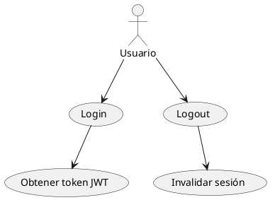

## Usuarios
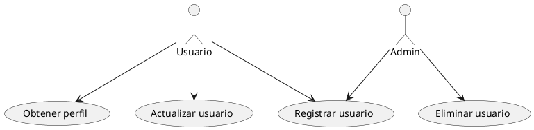

## Productos
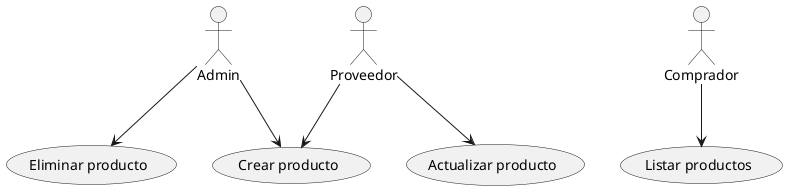

## Ofertas
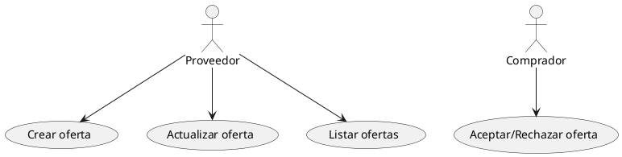

## Cotizaciones
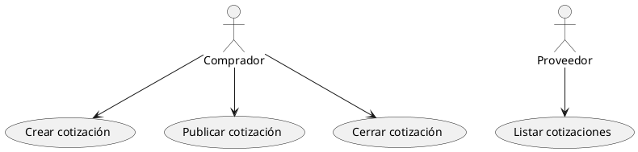

## Licitaciones
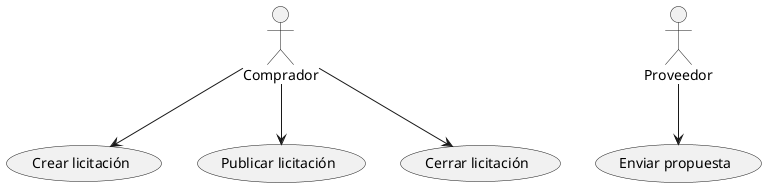

## Muestras
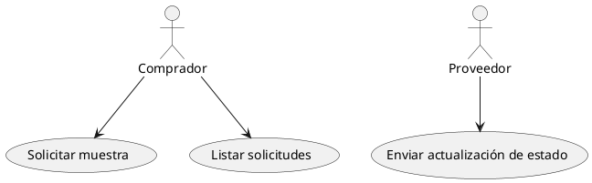

## Correos y Comunicaciones
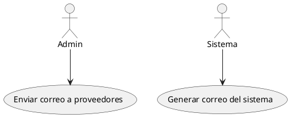

## Ayuda / Tickets
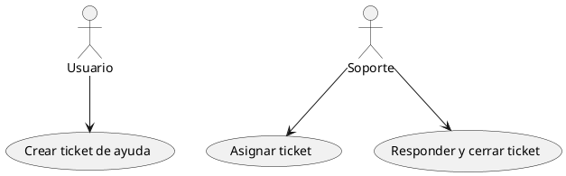

## Subidas de Archivos
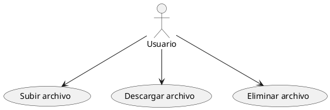

## Configuración de Scoring
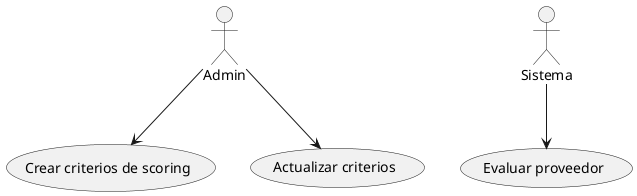

## Integraciones Productos/Ofertas/Cotizaciones
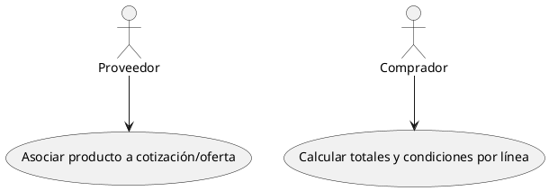

---
